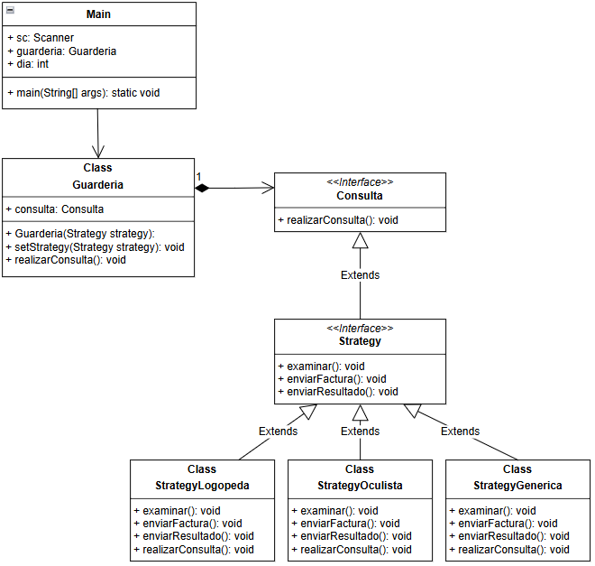

# 📌 Implementación del Patrón Strategy en una Guardería

## 📖 Introducción
Este proyecto implementa el **Patrón Strategy** para manejar diferentes tipos de consulta médica en una guardería. Dependiendo del día del mes, la guardería cambia su comportamiento eligiendo un tipo de consulta diferente:
- **Día 15** → Consulta con el Oculista.
- **Día 28** → Consulta con el Logopeda.
- **Cualquier otro día** → Consulta genérica con el médico de guardia.

Para lograr esto, utilizamos el Patrón Strategy, permitiendo a `Guarderia` cambiar su comportamiento dinámicamente sin modificar su código interno.

## 🖼️ UML del Proyecto


---

## 🎯 **Componentes del Patrón Strategy**
El Patrón Strategy se compone de **tres elementos principales**:

### 1️⃣ **Contexto (`Guarderia`)**
El contexto es el objeto cuyo comportamiento varía en función de la estrategia elegida. En este caso, `Guarderia` cambia su estrategia dependiendo del día del mes.

```java
public class Guarderia {
    private Strategy strategy;

    public Guarderia(Strategy strategy) {
        this.strategy = strategy;
    }

    public void setStrategy(Strategy strategy) {
        this.strategy = strategy;
    }

    public void realizarConsulta() {
        strategy.realizarConsulta();
    }
}
```
**Explicación:**
- `Guarderia` mantiene una referencia a `Strategy`, que puede cambiar dinámicamente.
- `realizarConsulta()` llama al método `realizarConsulta()` de la estrategia actual, sin saber qué estrategia específica se está usando.

---

### 2️⃣ **Interfaz `Strategy` (Definición de la Estrategia)**
Define los métodos que todas las estrategias deben implementar.

```java
public interface Strategy extends Consulta {
    void examinar();
    void enviarFactura();
    void enviarResultado();
}
```
**Explicación:**
- `Strategy` extiende `Consulta`, asegurando que todas las estrategias implementen `realizarConsulta()`.
- Declara `examinar()`, `enviarFactura()` y `enviarResultado()`, que serán implementados por cada estrategia concreta.

---

### 3️⃣ **Clases Concretas (Implementaciones de `Strategy`)**
Cada estrategia representa un tipo diferente de consulta.

#### **🟢 `StrategyOculista` (Día 15)**
```java
public class StrategyOculista implements Strategy {
    @Override
    public void examinar() {
        System.out.println("Examinando a día 15 con el doctor Wang, graduando la vista de los niños");
    }
    @Override
    public void enviarFactura() {
        System.out.println("Enviando factura a día 15 con el doctor Wang");
    }
    @Override
    public void enviarResultado() {
        System.out.println("Enviando resultado a día 15 con el doctor Wang");
    }
    @Override
    public void realizarConsulta() {
        this.examinar();
        this.enviarFactura();
        this.enviarResultado();
    }
}
```

#### **🟡 `StrategyLogopeda` (Día 28)**
```java
public class StrategyLogopeda implements Strategy {
    @Override
    public void examinar() {
        System.out.println("Examinando a día 28 con el doctor Fang, evaluando la dicción de los niños");
    }
    @Override
    public void enviarFactura() {
        System.out.println("Enviando factura a día 28 con el doctor Fang");
    }
    @Override
    public void enviarResultado() {
        System.out.println("Enviando resultado a día 28 con el doctor Fang");
    }
    @Override
    public void realizarConsulta() {
        this.examinar();
        this.enviarFactura();
        this.enviarResultado();
    }
}
```

#### **🔵 `StrategyGenerica` (Cualquier otro día)**
```java
public class StrategyGenerica implements Strategy {
    @Override
    public void examinar() {
        System.out.println("Examinando a día <sin especificar> con el doctor correspondiente");
    }
    @Override
    public void enviarFactura() {
        System.out.println("Enviando factura a día <sin especificar> con el doctor correspondiente");
    }
    @Override
    public void enviarResultado() {
        System.out.println("Enviando resultado a día <sin especificar> con el doctor correspondiente");
    }
    @Override
    public void realizarConsulta() {
        this.examinar();
        this.enviarFactura();
        this.enviarResultado();
    }
}
```

---

## 🔍 **Interfaz `Consulta` y su Propósito**

En este proyecto, **la interfaz `Consulta` no es parte del Patrón Strategy**, sino que **aumenta la abstracción de `Guarderia`**. `Consulta` permite que `Guarderia` no tenga que saber qué métodos concretos tiene cada estrategia.

```java
public interface Consulta {
    void realizarConsulta();
}
```
**Explicación:**
- `Consulta` solo define `realizarConsulta()`, sin exponer `examinar()`, `enviarFactura()` ni `enviarResultado()`.
- Cada estrategia implementa `Consulta`, lo que permite a `Guarderia` llamar `realizarConsulta()` sin conocer los detalles internos.

---

## 🏃‍♂️ **Ejemplo de Uso en `Main.java`**
```java
public class Main {
    public static void main(String[] args) {
        Scanner sc = new Scanner(System.in);
        Guarderia guarderia = new Guarderia(new StrategyGenerica());
        System.out.println("Introduzca el día de hoy (número entero): ");
        int dia = sc.nextInt();

        switch (dia) {
            case 15:
                guarderia.setStrategy(new StrategyOculista());
                System.out.println("--- Día 15: Visita del Oculista ---");
                break;
            case 28:
                guarderia.setStrategy(new StrategyLogopeda());
                System.out.println("--- Día 28: Visita del Logopeda ---");
                break;
            default:
                guarderia.setStrategy(new StrategyGenerica());
                System.out.println("--- Visita del médico de guardia ---");
                break;
        }
        guarderia.realizarConsulta();
        sc.close();
    }
}
```

---

## 🚀 **Conclusión**
✅ `Guarderia` puede cambiar de estrategia dinámicamente sin modificar su código.
✅ `Strategy` define una interfaz clara que permite agregar nuevas estrategias fácilmente.
✅ `Consulta` aumenta la abstracción y mantiene a `Guarderia` desacoplada de `Strategy`.

Este diseño sigue el **Principio de Abierto/Cerrado (OCP)** y el **Principio de Responsabilidad Única (SRP)**, haciendo que el código sea modular y extensible. 🎯🚀