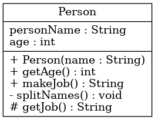

# UML y Código Relacionado

Este archivo contiene información sobre la relación entre el código y el diagrama UML correspondiente.

## **Descripción**

El diagrama UML y las capturas que se presentan a continuación están diseñados para representar la estructura del código de la clase `Person` y cómo se organiza.

---

### **Diagrama UML**

El siguiente diagrama UML corresponde al diseño de la clase `Person` en el código:

---

### **Captura del Código**

A continuación, una captura del código fuente relacionado con este diagrama UML:

---

### **Relación entre el Diagrama y el Código**

- El diagrama UML representa la clase abstracta `Person`, incluyendo:
  - Sus **atributos** (`personName` y `age`).
  - Sus **métodos** (`makeJob`, `getAge`, `splitNames`, `getJob`).
- La captura del código muestra la implementación detallada en Java.

Puedes utilizar esta información para entender cómo se mapean las características del diagrama al código real.
